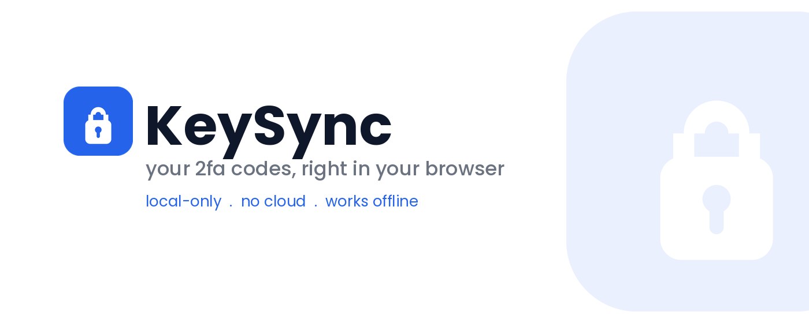
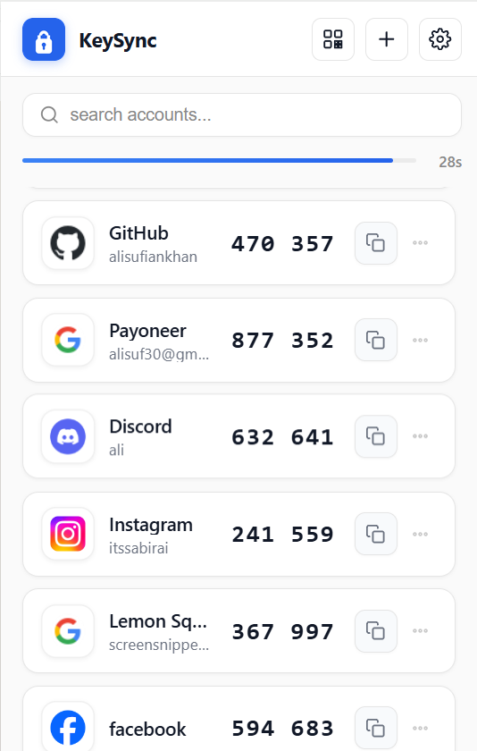
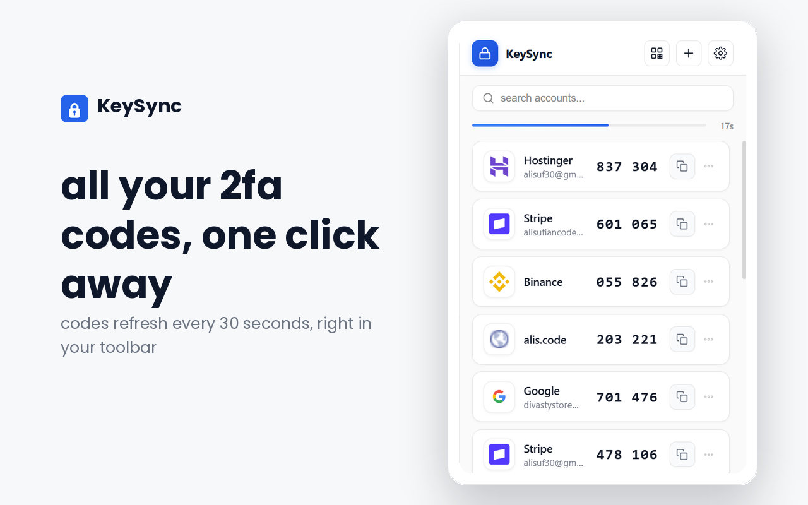
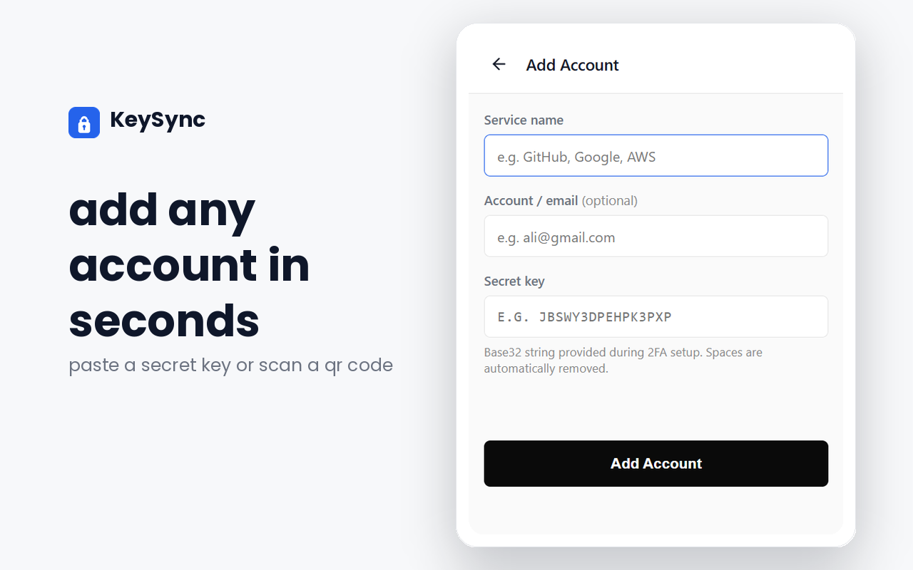
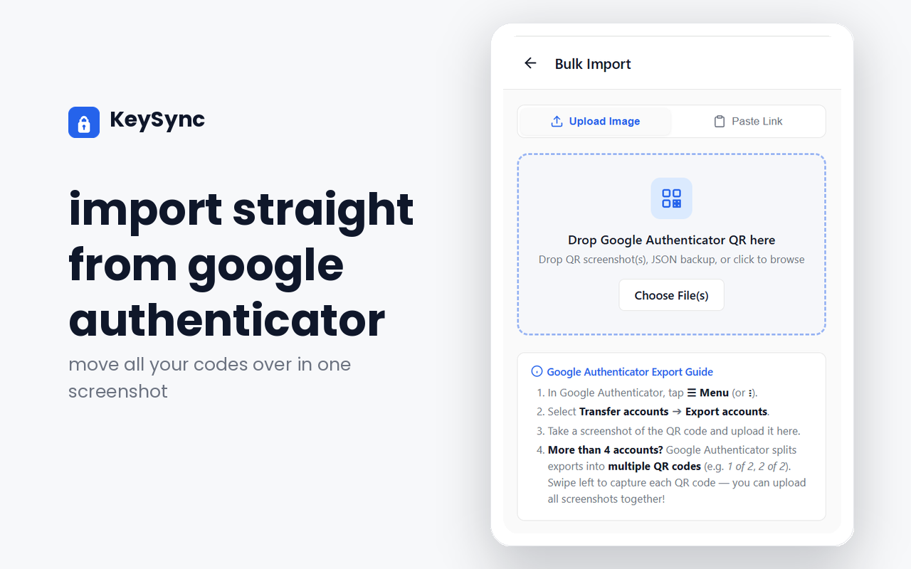
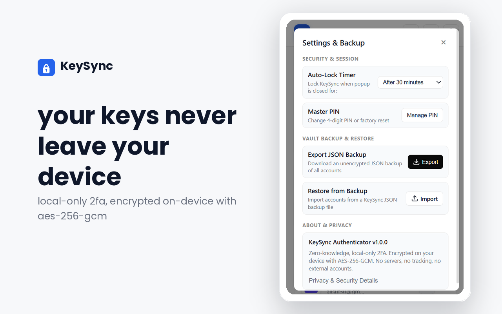
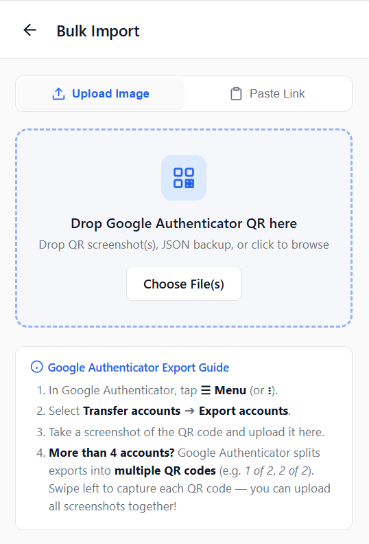
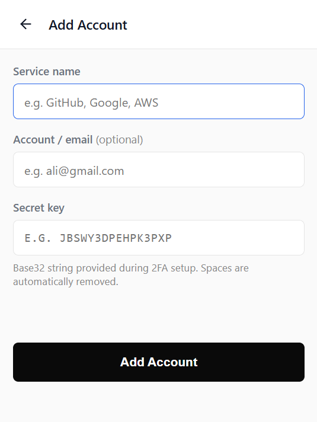
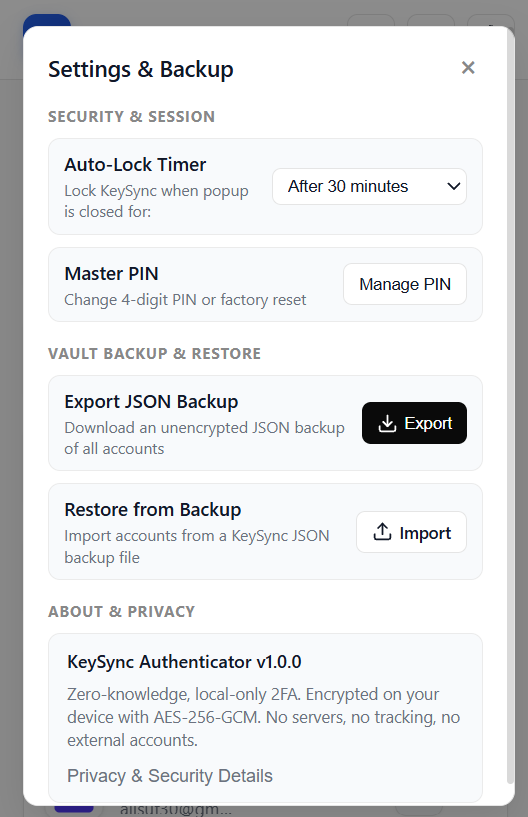
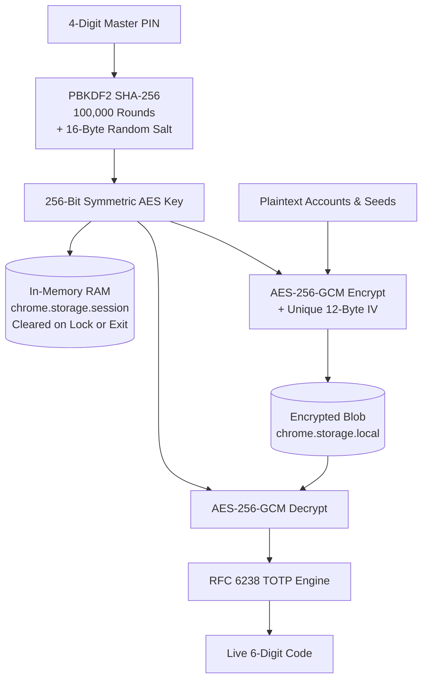

<p align="center">
  
</p>

# KeySync

<p align="center">
  <strong>Fast, Local-First 2FA Authenticator for Google Chrome</strong><br>
  Instant 1-click token copy, client-side AES-256-GCM vault encryption, and bulk Google Authenticator QR migration.
</p>

<p align="center">
  <a href="https://x.com/aliscodes"></a>
  
  
  
  
</p>

<p align="center">
  <a href="#the-problem-keysync-solves">Why KeySync</a> •
  <a href="#visual-tour">Visual Tour</a> •
  <a href="#security-architecture">Security Architecture</a> •
  <a href="#feature-comparison">Comparison</a> •
  <a href="#quickstart-installing-keysync-locally">Quickstart</a> •
  <a href="#author--creator">Author</a>
</p>

---

## The Problem KeySync Solves

Two-factor authenticators were designed for smartphones in 2011. Modern engineers and developers repeatedly context-switch all day long: grabbing a phone, passing biometric locks, waiting for a 30-second countdown, and manually typing 6 digits.

**KeySync eliminates this friction entirely.** It pins directly into your Chrome browser toolbar. One click copies your valid 6-digit TOTP code straight to your clipboard with instant toast confirmation.

- **Zero Cloud Dependence:** No remote databases, servers, or cloud sync.
- **Zero Telemetry:** 0 analytics, 0 tracking cookies, and 0 user accounts.
- **Hardware Cryptography:** Hardware-accelerated WebCrypto primitives running natively on your CPU.
- **Volatile RAM Sessions:** Unlocked vault keys live strictly in in-memory storage (`chrome.storage.session`) and auto-lock on idle.

---

## Visual Tour

<p align="center">
  
  <br>
  <em>Clean glassmorphic dark interface with real-time countdown progress rings and 1-click token copy.</em>
</p>

### Feature Highlights

<table>
  <tr>
    <td width="50%">
      
      <h4 align="center">⚡ 1-Click Desktop Toolbar</h4>
      <p align="center">Access your codes in 1 click or via global hotkey without reaching for a mobile device.</p>
    </td>
    <td width="50%">
      
      <h4 align="center">🔒 AES-256-GCM Vault</h4>
      <p align="center">Protected by a 4-digit Master PIN derived via 100,000 PBKDF2 SHA-256 iterations.</p>
    </td>
  </tr>
  <tr>
    <td width="50%">
      
      <h4 align="center">📲 Bulk QR Migration</h4>
      <p align="center">Drag and drop a Google Authenticator export QR screenshot to parse all accounts in seconds.</p>
    </td>
    <td width="50%">
      
      <h4 align="center">🛡️ 100% Offline &amp; Private</h4>
      <p align="center">Zero telemetry, zero analytics, zero external network calls, and complete data sovereignty.</p>
    </td>
  </tr>
</table>

### Core Workflows

<p align="center">
  
  
  
</p>
<p align="center">
  <em>From left to right: Google Auth batch QR drop, manual account creation with auto brand detection, and vault lock security settings.</em>
</p>

---

## Security Architecture

KeySync follows a strict **Zero-Knowledge, local-only** cryptographic architecture:



1. **Key Derivation (PBKDF2):**
   - The user configures a 4-digit Master PIN.
   - The PIN is stretched using PBKDF2 with SHA-256, 100,000 rounds, and a cryptographically random 16-byte salt (`crypto.getRandomValues`).
2. **Authenticated Symmetric Cipher (AES-256-GCM):**
   - Account secrets, issuer names, and account labels are encrypted as an authenticated payload.
   - A fresh 12-byte initialization vector (IV) is cryptographically generated on every single write operation.
3. **Volatile RAM Storage:**
   - The derived encryption key is cached only in volatile RAM via Chrome Manifest V3's `chrome.storage.session` API.
   - Keys are immediately zeroed out upon locking, closing the browser, or after a configurable idle timer (default: 15 minutes).
4. **Offline Migration Decoder:**
   - Decodes Google Authenticator `otpauth-migration://` QR codes client-side using a pure JavaScript Protocol Buffer parser. Secret seeds never leave your computer.

---

## Feature Comparison

| Capability | KeySync | Google Authenticator | Twilio Authy | Cloud Vaults |
| :--- | :--- | :--- | :--- | :--- |
| **Toolbar Access** | **1-Click Native Toolbar** | Mobile app only | Desktop deprecated | Via extension |
| **Storage Security** | **Device AES-256-GCM** | Google Cloud sync | Twilio Cloud sync | Remote database |
| **Google Auth Import** | **1-Click batch QR drop** | Not applicable | Manual secret entry | Manual secret entry |
| **Account Required** | **Zero (100% Anonymous)** | Google Account mandatory | SMS phone required | Master login & email |
| **Pricing & License** | **Free & Open Source (MIT)** | Free (Proprietary) | Free (Proprietary) | $36 to $60 / year |
| **Data Portability** | **Unrestricted JSON export** | QR screen only | Vendor locked in | Varies by provider |

---

## Quickstart: Installing KeySync Locally

You can load and test KeySync immediately in Google Chrome:

1. **Clone the repository:**
   ```bash
   git clone https://github.com/alisufiankhan/KeySync.git
   ```
2. **Open Extensions in Chrome:**
   - Navigate to `chrome://extensions/` in your Chrome browser.
3. **Enable Developer Mode:**
   - Toggle the **Developer mode** switch in the top-right corner.
4. **Load Unpacked:**
   - Click **Load unpacked** and select the cloned `KeySync` root folder.
5. **Pin to Toolbar:**
   - Click the puzzle icon in Chrome and pin **KeySync** for 1-click access!

---

## Deploying the Landing Page to Vercel

The root of this repository contains the standalone, high-performance landing page ([`index.html`](index.html), [`style.css`](style.css), [`app.js`](app.js), and [`privacy.html`](privacy.html)):

1. Import this repository in [Vercel](https://vercel.com/new).
2. Leave root directory as `./` (default).
3. Framework preset: **Other** (Static HTML).
4. Click **Deploy**. Vercel will host your landing page instantly with edge CDN caching and clean URLs configured via [`vercel.json`](vercel.json).

---

## Author & Creator

<table style="border: none;">
  <tr>
    <td width="100" valign="middle" align="center">
      
    </td>
    <td valign="middle">
      <strong>Ali Sufian</strong><br>
      Software Engineer building high-performance, local-first developer tools and zero-knowledge privacy utilities.<br>
      <a href="https://x.com/aliscodes">Follow @aliscodes on X</a> • <a href="https://github.com/alisufiankhan">@alisufiankhan on GitHub</a>
    </td>
  </tr>
</table>

---

## License

This project is licensed under the **MIT License**. See [PRIVACY.md](PRIVACY.md) and [THIRD_PARTY_LICENSES.md](THIRD_PARTY_LICENSES.md) for complete details.
