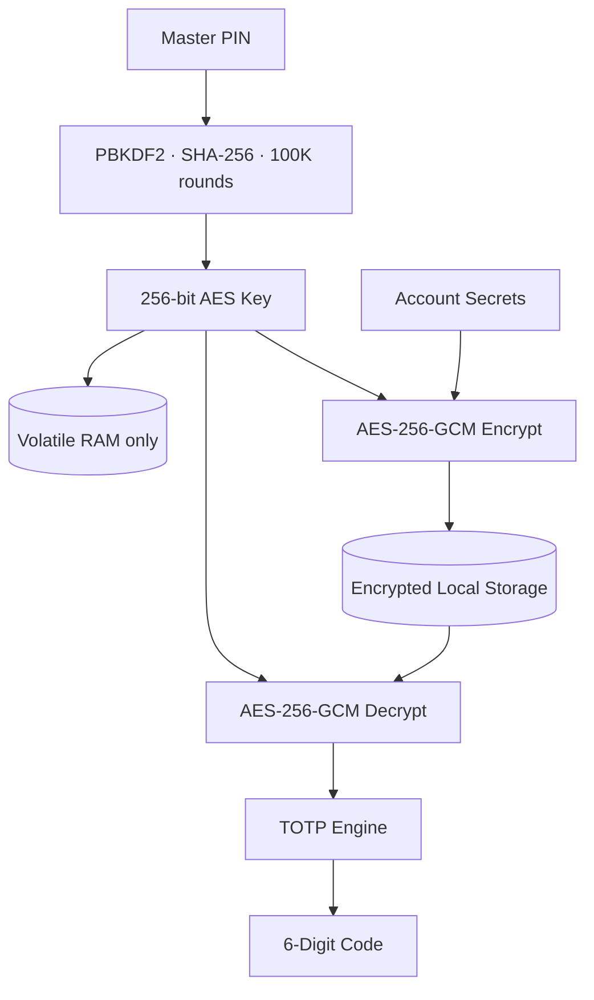

<p align="center">
  
</p>

# KeySync

<p align="center">
  <strong>Fast, Local-First 2FA Authenticator for Google Chrome</strong><br>
  1-click TOTP copy &nbsp;·&nbsp; AES-256-GCM encryption &nbsp;·&nbsp; Bulk Google Authenticator migration
</p>

<p align="center">
  <a href="https://x.com/aliscodes"></a>
  
  
  
  
</p>

<p align="center">
  <a href="#why-keysync">Why KeySync</a> &nbsp;·&nbsp;
  <a href="#screenshots">Screenshots</a> &nbsp;·&nbsp;
  <a href="#security-architecture">Security</a> &nbsp;·&nbsp;
  <a href="#feature-comparison">Comparison</a> &nbsp;·&nbsp;
  <a href="#install-locally">Install</a> &nbsp;·&nbsp;
  <a href="#author">Author</a>
</p>

---

## Why KeySync

Two-factor authenticators were designed for smartphones in 2011. Modern developers context-switch all day — grabbing a phone, passing biometric locks, waiting for a countdown, then manually typing 6 digits.

**KeySync eliminates that friction.** It lives in your Chrome toolbar. One click copies your valid TOTP code straight to your clipboard.

- **Zero Cloud** — No remote databases, servers, or cloud sync
- **Zero Telemetry** — No analytics, no tracking, no user accounts required
- **Hardware Crypto** — WebCrypto primitives accelerated natively by your CPU
- **Volatile Sessions** — Unlocked vault keys live in RAM and auto-lock on idle

---

## Screenshots

<details>
<summary><strong>Main Interface</strong></summary>
<br>

<p align="center">
  
  <br>
  <em>All your 2FA codes in one click from the Chrome toolbar.</em>
</p>

</details>

<details>
<summary><strong>Core Workflows — Import, Add Account, Settings</strong></summary>
<br>

<p align="center">
  
  
  
</p>
<p align="center">
  <em>Google Auth QR drop &nbsp;·&nbsp; Manual account entry &nbsp;·&nbsp; Vault lock settings</em>
</p>

</details>

<details>
<summary><strong>Feature Highlights</strong></summary>
<br>

<p align="center">
  
  
</p>
<p align="center">
  
  
</p>

</details>

---

## Security Architecture

KeySync uses a **Zero-Knowledge, local-only** cryptographic model. Your secrets never leave your device.



| Step | Detail |
| :--- | :--- |
| **Key Derivation** | PIN stretched via PBKDF2 (SHA-256, 100K rounds, random 16-byte salt) into a 256-bit key |
| **Encryption** | All secrets encrypted with AES-256-GCM — fresh 12-byte IV on every write |
| **Volatile Storage** | Derived key lives only in RAM, zeroed on lock, browser close, or idle timeout |
| **QR Migration** | Google Auth `otpauth-migration://` QR codes decoded entirely client-side |

---

## Feature Comparison

| Capability | **KeySync** | Google Authenticator | Twilio Authy | Cloud Vaults |
| :--- | :--- | :--- | :--- | :--- |
| Toolbar Access | **1-Click Native** | Mobile only | Desktop deprecated | Via extension |
| Storage Security | **Device AES-256-GCM** | Google Cloud sync | Twilio Cloud sync | Remote database |
| Google Auth Import | **Bulk QR drop** | N/A | Manual entry | Manual entry |
| Account Required | **Zero (Anonymous)** | Google Account | SMS phone | Master login |
| Pricing | **Free & MIT** | Free (Proprietary) | Free (Proprietary) | $36–$60/yr |
| Data Portability | **Unrestricted JSON** | QR screen only | Vendor locked | Varies |

---

## Install Locally

```bash
git clone https://github.com/alisufiankhan/KeySync.git
```

1. Open **`chrome://extensions/`** in Google Chrome
2. Enable **Developer mode** (toggle, top-right corner)
3. Click **Load unpacked** → select the cloned `KeySync` folder
4. Click the 🧩 puzzle icon → **Pin KeySync**

Click the KeySync icon to open your vault.

---

## Deploy the Landing Page

The repo root is a static landing page (`index.html`, `style.css`, `privacy.html`):

1. Import this repo in [Vercel](https://vercel.com/new)
2. Framework preset → **Other** (Static HTML), root `./`
3. Click **Deploy** — edge CDN and clean URLs configured via [`vercel.json`](vercel.json)

---

## Author

<table>
  <tr>
    <td width="90" align="center" valign="middle">
      
    </td>
    <td valign="middle">
      <strong>Ali Sufian</strong><br>
      Software Engineer building local-first developer tools and zero-knowledge privacy utilities.<br>
      <a href="https://x.com/aliscodes">@aliscodes on X</a> &nbsp;·&nbsp; <a href="https://github.com/alisufiankhan">@alisufiankhan on GitHub</a>
    </td>
  </tr>
</table>

---

## License

MIT License. See [PRIVACY.md](PRIVACY.md) and [THIRD_PARTY_LICENSES.md](THIRD_PARTY_LICENSES.md) for full details.
