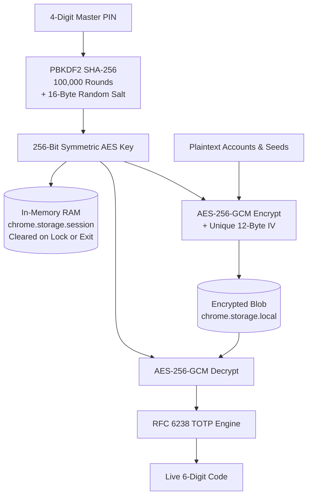

<p align="center">
  
</p>

# KeySync

<p align="center">
  <strong>Fast, Local-First 2FA Authenticator for Google Chrome</strong><br>
  Instant 1-click token copy, client-side AES-256-GCM vault encryption, and bulk Google Authenticator QR migration.
</p>

<p align="center">
  <a href="https://x.com/aliscodes"></a>
  
  
  
  
</p>

<p align="center">
  <a href="#why-keysync">Why KeySync</a> •
  <a href="#interface-tour">Interface Tour</a> •
  <a href="#security-architecture">Security Architecture</a> •
  <a href="#comparison">Comparison</a> •
  <a href="#installation">Installation</a> •
  <a href="#author">Author</a>
</p>

---

## Why KeySync?

Authenticators were designed for smartphones back in 2011. Modern desktop developers context-switch dozens of times a day: reaching for a phone, clearing biometric locks, waiting for countdowns, and manually retyping 6 digits.

**KeySync brings your 2FA directly to your browser toolbar.**

- ⚡ **1-Click Copy:** Click any account to instantly copy its active 6-digit TOTP code to your clipboard.
- 🔒 **AES-256-GCM Encryption:** Master PIN derived via 100,000 PBKDF2 iterations using hardware WebCrypto.
- 🧠 **Volatile RAM Sessions:** Unlocked keys live only in in-memory memory (`chrome.storage.session`) and auto-lock on idle.
- 📲 **1-Click QR Migration:** Drag & drop Google Authenticator export QR screenshots to batch-import all accounts client-side.
- 🛡️ **Zero Cloud / Zero Telemetry:** 100% offline-first. No accounts, no servers, no analytics.

---

## Interface Tour

<p align="center">
  
  <br>
  <sub><b>Main Toolbar Popup:</b> Real-time 30-second countdown progress rings, instant 1-click token copy, and auto brand detection.</sub>
</p>

### Core Workflows

| 1. Bulk Google Auth Import | 2. Add / Edit Account | 3. Vault & Security Settings |
| :---: | :---: | :---: |
|  |  |  |
| Drag & drop QR screenshot to batch import all accounts | Manual secret entry with automatic brand icon detection | Configure auto-lock timers, change PIN, and export backups |

<details>
<summary><b>🖼️ Feature Slides &amp; Promo Graphics (Click to Expand 4 Slides)</b></summary>
<br>

<table>
  <tr>
    <td width="50%">
      
      <h4 align="center">⚡ 1-Click Desktop Toolbar</h4>
      <p align="center">Instant toolbar access without reaching for your phone.</p>
    </td>
    <td width="50%">
      
      <h4 align="center">🔒 AES-256-GCM Vault</h4>
      <p align="center">Protected by a 4-digit Master PIN via 100,000 PBKDF2 rounds.</p>
    </td>
  </tr>
  <tr>
    <td width="50%">
      
      <h4 align="center">📲 Bulk QR Migration</h4>
      <p align="center">Import Google Authenticator accounts client-side in seconds.</p>
    </td>
    <td width="50%">
      
      <h4 align="center">🛡️ 100% Offline &amp; Private</h4>
      <p align="center">Zero telemetry, zero cloud tracking, and complete data freedom.</p>
    </td>
  </tr>
</table>

</details>

---

## Security Architecture

KeySync operates under a strict **Zero-Knowledge, local-only** cryptographic threat model:



1. **PBKDF2 Key Derivation:** 4-digit Master PIN is stretched using PBKDF2 SHA-256 (100,000 rounds) with a unique 16-byte cryptographically secure random salt.
2. **Authenticated AES-256-GCM:** Account secrets and labels are encrypted with AES-256-GCM using a unique 12-byte CSPRNG IV generated per write.
3. **Volatile In-Memory Session:** The derived AES key resides only in volatile RAM via Manifest V3's `chrome.storage.session`. Keys are instantly purged upon lock, browser exit, or idle timeout.
4. **Client-Side Protobuf Migration:** Google Authenticator `otpauth-migration://` QR payloads are decoded locally using client-side Protocol Buffers. Seeds never touch a server.

---

## Comparison

| Capability | KeySync | Google Authenticator | Twilio Authy | Cloud Vaults |
| :--- | :--- | :--- | :--- | :--- |
| **Toolbar Access** | **1-Click Native Toolbar** | Mobile app only | Desktop deprecated | Via extension |
| **Storage Security** | **Device AES-256-GCM** | Google Cloud sync | Twilio Cloud sync | Remote database |
| **Google Auth Import** | **1-Click batch QR drop** | Not applicable | Manual secret entry | Manual secret entry |
| **Account Required** | **Zero (100% Anonymous)** | Google Account mandatory | SMS phone required | Master login & email |
| **Pricing & License** | **Free & Open Source (MIT)** | Free (Proprietary) | Free (Proprietary) | $36 to $60 / year |
| **Data Portability** | **Unrestricted JSON export** | QR screen only | Vendor locked in | Varies by provider |

---

## Installation

### Load Unpacked in Chrome (Developer Mode)

1. **Clone the repository:**
   ```bash
   git clone https://github.com/alisufiankhan/KeySync.git
   ```
2. **Open Extensions:** Navigate to `chrome://extensions/` in Google Chrome.
3. **Enable Developer Mode:** Turn on the toggle switch in the top-right corner.
4. **Load Unpacked:** Click **Load unpacked** and select the cloned `KeySync` root folder.
5. **Pin to Toolbar:** Pin **KeySync** from the Chrome puzzle menu for 1-click access.

---

## Deploying the Landing Page to Vercel

The root of this repository contains the standalone, static landing page ([`index.html`](index.html), [`style.css`](style.css), [`app.js`](app.js), and [`privacy.html`](privacy.html)):

1. Import this repository in [Vercel](https://vercel.com/new).
2. Leave root directory as `./` (default).
3. Framework preset: **Other** (Static HTML).
4. Click **Deploy**. Vercel will host your landing page instantly with edge CDN caching and clean URLs configured via [`vercel.json`](vercel.json).

---

## Author

<table style="border: none;">
  <tr>
    <td width="90" valign="middle" align="center">
      
    </td>
    <td valign="middle">
      <strong>Ali Sufian</strong><br>
      Software Engineer building high-performance, local-first developer tools and zero-knowledge privacy utilities.<br>
      <a href="https://x.com/aliscodes">Follow @aliscodes on X</a> • <a href="https://github.com/alisufiankhan">@alisufiankhan on GitHub</a>
    </td>
  </tr>
</table>

---

## License

This project is licensed under the **MIT License**. See [PRIVACY.md](PRIVACY.md) and [THIRD_PARTY_LICENSES.md](THIRD_PARTY_LICENSES.md) for complete details.
